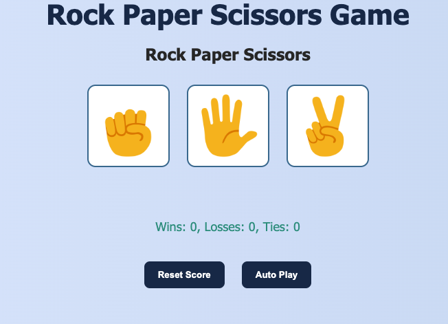

## Rock Paper Scissors Game

This is a simple, interactive **Rock Paper Scissors** game built using **HTML**, **JavaScript**, and **CSS**. Players can choose Rock, Paper, or Scissors to compete against a computer opponent with a randomly selected move.

## Features

- Clean, responsive layout with modern styling
- Interactive gameplay with instant results
- Fully client-side (no backend required)

## Screenshot

## How to Use

1. Clone or download the repository
2. Open `index.html` in any web browser
3. Play the game by clicking Rock, Paper, or Scissors

## Technologies Used

- HTML5
- CSS3
- Vanilla JavaScript

## Feedback

Feel free to fork this project or submit pull requests with improvements and additional features. Feedback and contributions are always welcome!

